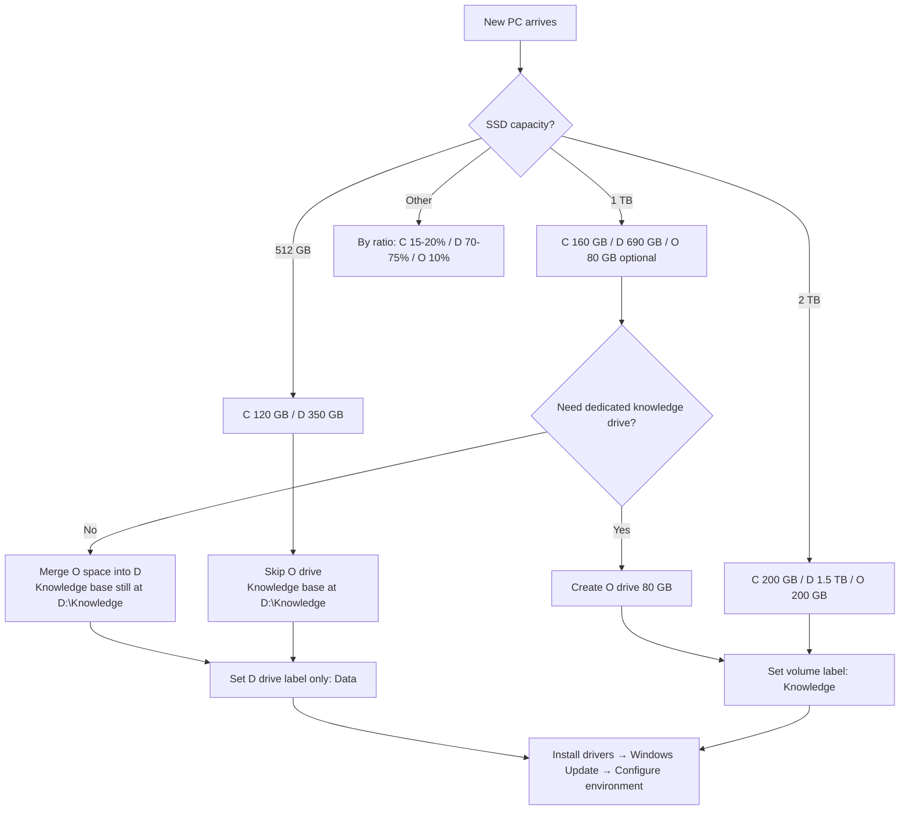

# Partition Decision Tree

> The first thing to do with a new PC is not install drivers — it's partition the disk. Your partition plan depends on SSD capacity.
> Core philosophy: Plan B (apps on C: + data on D:). C: holds only software binaries; data and caches are redirected to D:.

---

## 1. Partition Plan Decision Table

| SSD Capacity | C: (System + Apps) | D: (Data + Caches) | O: (Knowledge Base, optional) | Use Case |
|--------------|--------------------|--------------------|-------------------------------|----------|
| 512 GB       | 120 GB             | 350 GB             | Skip (knowledge base under D:) | Ultrabook / compact workstation |
| 1 TB         | 160 GB             | 690 GB             | 80 GB (optional)              | **Recommended** — primary research machine |
| 2 TB         | 200 GB             | 1.5 TB             | 200 GB                        | Spacious setup with large models / datasets |
| Other        | 15%–20%            | 70%–75%            | 10% (optional)                | Calculate proportionally |

> Note: In the 1 TB plan, C=160 + D=690 + O=80 ≈ 930 GB (actual usable capacity). The remaining ~70 GB is reserved for the recovery partition and unallocated buffer.

---

## 2. Partition Decision Tree



---

## 3. Partition Timing (Critical)

| Step | When | Why |
|------|------|-----|
| Partition | **After first boot, before installing drivers** | After drivers are installed, system restore points + hibernation files lock large amounts of space, making C: compression impossible |
| Volume labels | Immediately after partitioning | Do it while you're at it — easy to forget later |
| Driver install | After partitioning | GPU / chipset / network drivers |
| Windows Update | After drivers | Windows Update |
| Environment setup | After all basics are ready | conda / Git / SSH / AI tools |

**Correct order**: Unbox → First boot → Skip OOBE network setup (optional) → Partition → Set volume labels → Install drivers → Windows Update → Configure environment

---

## 4. Volume Label Recommendations

| Drive | Label | Change? | Notes |
|-------|-------|---------|-------|
| C:    | Windows (default) | ❌ Leave as-is | System drive — keep default to avoid software recognition issues |
| D:    | Data              | ✅ Change | Data + cache drive |
| O:    | Knowledge         | ✅ Change | Knowledge base drive (O = Obsidian / Owner) |

> Why O instead of E/F? The O drive letter has a low collision probability, and the letter shape resembles a container for a "knowledge base 📚".

### PowerShell Commands to Set Volume Labels

```powershell
# Run PowerShell as Administrator

# Set D: volume label to Data
Set-Volume -DriveLetter D -NewFileSystemLabel "Data"

# Set O: volume label to Knowledge
Set-Volume -DriveLetter O -NewFileSystemLabel "Knowledge"

# Verify
Get-Volume | Format-Table DriveLetter, FileSystemLabel, SizeRemaining, Size
```

---

## 5. Handling Immovable Files

If Disk Management reports "cannot shrink — immovable files exist" when compressing C:, handle in this order:

### Step 1: Disable System Restore

```powershell
# Administrator PowerShell
# Check system restore status
vssadmin list shadows

# Disable system restore on C:
Disable-ComputerRestore -Drive "C:\"
```

### Step 2: Disable Hibernation (frees several GB)

```powershell
# Remove hiberfil.sys
powercfg -h off
```

### Step 3: Temporarily Disable Virtual Memory

1. `Win + R` → `sysdm.cpl` → Advanced → Performance Settings → Advanced → Virtual Memory
2. Uncheck "Automatically manage paging file size for all drives"
3. Select C: → "No paging file" → Set
4. Restart the PC
5. Re-enable after partitioning (recommended on D:)

### Step 4: Clean Up + Shrink

```powershell
# Clean temporary files
cleanmgr /sagerun:1

# Or use Storage Sense
Clear-RecycleBin -Force

# Then retry shrinking C: in Disk Management
```

### Step 5: Restore Settings

After partitioning:
- Re-enable virtual memory (custom size recommended, on D:)
- Optionally re-enable system restore (research machines: disable and use D: disk images instead)

---

## 6. Plan B: Apps on C: + Data on D:

### Core Principles

| Type | Location | Notes |
|------|----------|-------|
| App binaries | C: | `C:\Program Files\` or user directory |
| User data | D: | Redirect via software settings |
| Caches | D: | Redirect via environment variables or junctions |
| Models / datasets | D: | `D:\Models` `D:\Datasets` |

### Advantages

1. **C: size stays manageable**: Only software binaries — 160 GB is enough for 3–5 years
2. **Centralized data**: One-click D: backup; reinstall Windows without worry
3. **Reinstall-safe**: After formatting C:, all D: data / caches / models remain intact
4. **Easy cache cleanup**: With caches centralized on D:, periodic cleanup is straightforward

### Recommended Directory Structure

```
C:\                              # System drive
├── Program Files\               # System-wide software
├── Program Files (x86)\
└── Users\<USER>\                # Per-user software config

D:\                              # Data drive
├── Data\                        # Personal data
│   ├── Documents\
│   ├── Downloads\
│   └── Projects\
├── Caches\                      # All caches (centralized)
│   ├── pip\
│   ├── npm\
│   ├── uv\
│   ├── conda\
│   └── Cursor\
├── Models\                      # HF models
├── Datasets\
├── Environments\                # conda environments
└── Knowledge\                   # Knowledge base (when no O: drive)

O:\                              # Knowledge drive (optional)
└── Knowledge\
    ├── Obsidian\
    ├── Literature\
    └── Notes\
```

---

## 7. Special Cases

### Case 1: Pre-installed PC with C: already full

- Use a partition tool (e.g. DiskGenius / AOMEI) for "non-destructive resize"
- Prefer junctioning migratable parts of `Users\<USER>\AppData` to D:
- Don't force C: below 100 GB — the system will feel sluggish

### Case 2: Dual SSD (e.g. laptop M.2 + SATA)

- C: on the fast drive (system + frequently used software)
- D: on the large slower drive (data + caches + models)
- O: can be skipped

### Case 3: Single SSD ≥ 2 TB

- Strongly recommend a dedicated O: drive for Obsidian / literature library
- Once the knowledge base is isolated, sync it separately via Syncthing / Git without affecting the data drive

---

## 8. Checklist

- [ ] Partitioning complete; C / D (/ O) drive letters correct
- [ ] Volume labels set: D = Data, O = Knowledge
- [ ] System restore disabled (or reconfigured to D:)
- [ ] Hibernation file removed (if hibernation is not needed)
- [ ] Virtual memory moved to D:
- [ ] D: directory skeleton created (Data / Caches / Models / Datasets / Environments)
- [ ] Ready for next step: install drivers
