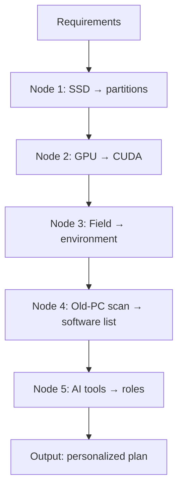

# Decision flow

> For the skill AI: detailed decision trees and classification rules for new-PC setup.
> After requirements gathering, walk each node and output a personalized migration plan.

---

## 1. Required input fields

Collect before deciding (ask if missing):

| Field | Type | Example | Use |
|------|------|---------|-----|
| `ssd_capacity` | enum: 256/512/1024/2048/4096 | 1024 | Partition plan |
| `ssd_count` | int | 1 | Single / dual SSD |
| `gpu_model` | string | RTX 5070 Ti | CUDA version |
| `gpu_arch` | enum: Ampere/Ada/Hopper/Blackwell | Blackwell | Minimum CUDA |
| `major` | string | Math / AI research | Environment emphasis |
| `workload` | enum: research/dev/writing/mixed | research | Software priority |
| `old_pc_scan` | path \| null | `D:\Reports\old-pc-scan-report.md` | Keep/cut list |
| `ai_tools_used` | list | [Cursor, Trae, Codex] | AI role split |
| `knowledge_base` | bool | true | Whether O: drive |
| `budget_time` | int (hours) | 8 | Day-one time budget |

---

## 2. Overview



---

## 3. Node 1: SSD capacity → partitions

### Rules

| SSD capacity | C: | D: | O: | Notes |
|-------------|----|----|-----|-------|
| ≤ 256 GB | 100 GB | remainder | none | Compact; knowledge on D: |
| 512 GB | 120 GB | 350 GB | none | Knowledge at `D:\Knowledge` |
| 1 TB | 160 GB | 690 GB | 80 GB (optional) | **Recommended** |
| 2 TB | 200 GB | 1.5 TB | 200 GB | Spacious |
| ≥ 4 TB | 250 GB | 3 TB+ | 300 GB | Workstation |

### Branches

- **Dual SSD**: C: on fast drive (256–512 GB), D: on large drive; skip O:
- **`knowledge_base = false`**: no O:; merge into D:
- **`ssd_count = 1 && ssd_capacity ≤ 512`**: force no O:

### Output

```
Partition plan:
  C: {size}GB, label Windows (default)
  D: {size}GB, label Data
  O: {size}GB, label Knowledge (if applicable)
```

---

## 4. Node 2: GPU → CUDA version

### Rules

| GPU arch | Examples | sm_ | Min CUDA | Recommended CUDA |
|---------|----------|-----|----------|------------------|
| Turing | RTX 20xx | sm_75 | 10.1 | 12.1 |
| Ampere | RTX 30xx | sm_86 | 11.1 | 12.1 |
| Ada Lovelace | RTX 40xx | sm_89 | 11.8 | 12.4 |
| Hopper | H100 | sm_90 | 11.8 | 12.4 |
| **Blackwell** | **RTX 50xx** | **sm_120** | **12.8** | **12.8+** |

### Key rules

- **Blackwell (RTX 50 series) requires CUDA 12.8+** or `sm_120` is unrecognized and PyTorch fails with `CUDA error: no kernel image is available`
- Wrong CUDA is painful to roll back — **confirm GPU arch before installing CUDA**
- PyTorch pairing: see [PyTorch compatibility matrix](https://pytorch.org/)

### Branches

- **`gpu_model = iGPU`**: skip CUDA; Python + CPU PyTorch only
- **`gpu_model = Apple Silicon`**: use MPS; no CUDA
- **`gpu_model = AMD`**: ROCm (limited on Windows; prefer Linux)

### Output

```
CUDA config:
  Architecture: Blackwell
  sm_: sm_120
  Minimum CUDA: 12.8
  Recommended CUDA: 12.8
  Recommended PyTorch: cu128
  Driver: ≥ 5xx.xx
```

---

## 5. Node 3: Field → environment

### Rules

| Field | Core stack | Required | Optional |
|-------|-----------|----------|----------|
| **AI research** | conda + PyTorch | Miniconda / PyTorch / CUDA / Git / SSH | W&B / Jupyter |
| **Dev** | Node + Python | Node / Python / Git / Docker | pnpm / Bun |
| **Math** | LaTeX + Python | TeX Live / Python / Git | SymPy / SageMath |
| **Writing** | LaTeX + Obsidian | TeX Live / Obsidian / Zotero | — |
| **Mixed** | Full stack | conda + Node + LaTeX | Docker / WSL2 |

### Branches

- **`workload = research && gpu_arch = Blackwell`**: PyTorch nightly or cu128
- **`workload = dev`**: promote Docker from Defer to Fit-out
- **`major = math && workload = writing`**: promote LaTeX to Foundation

### Templates

#### AI research

```yaml
Foundation:
  - Miniconda
  - Python 3.11
  - Git
  - SSH
  - NVIDIA Driver
  - CUDA 12.8
  - PyTorch (cu128)
  - Cursor or Trae
Fit-out:
  - Obsidian
  - Zotero
  - Chrome
  - WeChat
Defer:
  - Docker
  - WSL2
  - Syncthing
```

#### Math

```yaml
Foundation:
  - TeX Live (or MiKTeX)
  - Python
  - Git
  - SSH
  - Cursor or Trae
Fit-out:
  - Obsidian
  - Zotero
  - Chrome
Defer:
  - conda (if no large models)
  - Docker
```

### Output

```
Environment:
  Direction: AI research
  Foundation: [Miniconda, Python, Git, SSH, NVIDIA Driver, CUDA 12.8, PyTorch cu128, Cursor]
  Fit-out: [Obsidian, Zotero, Chrome, WeChat]
  Defer: [Docker, WSL2, Syncthing]
```

---

## 6. Node 4: Old-PC scan → software list

### Rules

Read `old_pc_scan` (from `scan-old-pc.ps1`) and classify each app:

```
if last_used < 30 days && frequency >= 10:
    layer = Foundation (if in foundation list)
    decision = migrate
elif last_used < 90 days && frequency >= 3:
    layer = Fit-out
    decision = migrate
elif last_used < 180 days:
    layer = Defer
    decision = defer (install when needed)
else:
    decision = cut
```

### Foundation force-list (regardless of frequency)

- conda / Python
- Git
- SSH
- NVIDIA Driver + CUDA (if NVIDIA GPU)
- AI IDE (Cursor or Trae)

### Dedup rules

| Category | Keep | Primary | Secondary |
|----------|------|---------|-----------|
| Browser | 2 | Chrome | Edge |
| Editor / IDE | 2 | Cursor or Trae | VS Code |
| AI IDE | 2 | primary | backup |
| AI assistant | 1 | most used | — |
| AI CLI | 2 | Codex or Trae CLI | other |
| Archive tool | 1 | 7-Zip | — |
| Terminal | 1 | Windows Terminal | — |
| Markdown | 1 | Obsidian | — |

### Output

```
Software list:
  Migrate (Foundation): [...]
  Migrate (Fit-out): [...]
  Defer: [...]
  Cut: [...]
  Dedup remove: [...]
```

---

## 7. Node 5: AI tools → roles

### Matrix

| User tools | Brain | Executor | Automation |
|------------|-------|----------|------------|
| Cursor + Codex | Cursor | Codex CLI | Codex exec |
| Trae + Codex | Trae | Codex CLI | Codex exec |
| Cursor + Trae | Cursor (primary) | Trae (backup brain) | — |
| Cursor only | Cursor | Cursor terminal | — |
| Trae only | Trae | Trae terminal | — |
| Cursor + Trae + Codex | Cursor | Codex CLI | Codex exec |

### Principles

1. **Brain**: read docs + plan + decide + supervise
2. **Executor**: no global doc read; explicit instructions only
3. **Automation**: scheduled; log results

### Safety red lines (mandatory)

AI must not: edit registry / install drivers / change BIOS / format / delete system files / disable firewall.

### Output

```
AI roles:
  Brain: Cursor
  Executor: Codex CLI
  Automation: Codex exec
  Janitor AI: daily 03:00 disk scan
  Librarian AI: weekly Sun 03:00 Obsidian index
```

---

## 8. Example combinations

### Plan A: 1TB + RTX 5070 + AI research (common)

```yaml
Partitions:
  C: 160GB
  D: 690GB
  O: 80GB
CUDA: 12.8 (Blackwell sm_120)
Environment:
  Foundation: [Miniconda, Python 3.11, Git, SSH, NVIDIA Driver, CUDA 12.8, PyTorch cu128, Cursor]
  Fit-out: [Obsidian, Zotero, Chrome, WeChat]
  Defer: [Docker, WSL2, Syncthing]
AI roles:
  Brain: Cursor
  Executor: Codex CLI
  Automation: Codex exec
Estimated time: 4-6 hours
```

### Plan B: 512GB + RTX 4060 + math

```yaml
Partitions:
  C: 120GB
  D: 350GB
  O: none (knowledge at D:\Knowledge)
CUDA: 12.4 (Ada sm_89)
Environment:
  Foundation: [TeX Live, Python, Git, SSH, Cursor]
  Fit-out: [Obsidian, Zotero, Chrome, WeChat]
  Defer: [conda, Docker]
AI roles:
  Brain: Cursor
  Executor: Cursor terminal
  Automation: none
Estimated time: 3-4 hours
```

### Plan C: 2TB + RTX 5090 + AI research + dev

```yaml
Partitions:
  C: 200GB
  D: 1.5TB
  O: 200GB
CUDA: 12.8 (Blackwell sm_120)
Environment:
  Foundation: [Miniconda, Python, Node, Git, SSH, NVIDIA Driver, CUDA 12.8, PyTorch cu128, Cursor, Trae]
  Fit-out: [Obsidian, Zotero, Chrome, WeChat, VS Code]
  Defer: [Docker, WSL2, Syncthing]
AI roles:
  Brain: Cursor
  Backup brain: Trae
  Executor: Codex CLI
  Automation: Codex exec
Estimated time: 6-8 hours
```

### Plan D: 512GB + iGPU + writing

```yaml
Partitions:
  C: 120GB
  D: 350GB
  O: none
CUDA: none
Environment:
  Foundation: [TeX Live, Obsidian, Git, Cursor]
  Fit-out: [Zotero, Chrome, WeChat]
  Defer: [conda, Docker, CUDA]
AI roles:
  Brain: Cursor
  Executor: Cursor terminal
Estimated time: 2-3 hours
```

---

## 9. Standard output format

```markdown
# New PC setup plan

## User profile
- SSD: {capacity} GB
- GPU: {model} ({arch})
- Direction: {workload}
- Estimated time: {hours} hours

## 1. Partitions
(from Node 1)

## 2. CUDA / drivers
(from Node 2)

## 3. Environment
(from Node 3)

## 4. Software keep/cut list
(from Node 4)

## 5. AI tool roles
(from Node 5)

## 6. Execution order
1. Partitions + labels
2. Drivers + CUDA
3. Windows Update
4. Foundation software
5. Cache migration
6. AI tool setup
7. Fit-out software
8. Verification + progress.md
```

---

## 10. Exception handling

### Missing SSD capacity

→ Ask: "What is your SSD capacity?"

### Unknown GPU

→ Suggest: `nvidia-smi` or `Get-WmiObject Win32_VideoController`

### Missing old-PC scan

→ Prompt to run `scan-old-pc.ps1`, or skip Node 4 (foundation list only)

### Insufficient time budget

→ Trim by priority:
1. Keep: partitions + drivers + foundation
2. Postpone: cache migration + fit-out
3. Skip: defer tier

### Blackwell GPU + user wants CUDA 12.4

→ Warn: "Blackwell (sm_120) needs CUDA 12.8+. CUDA 12.4 will break PyTorch GPU. Continue anyway?"
